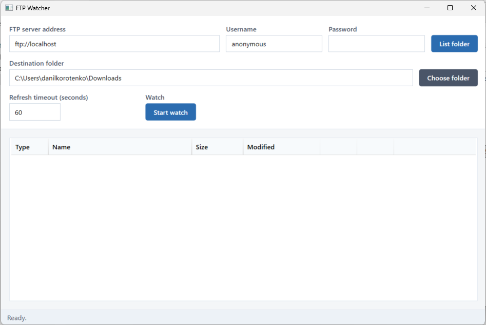
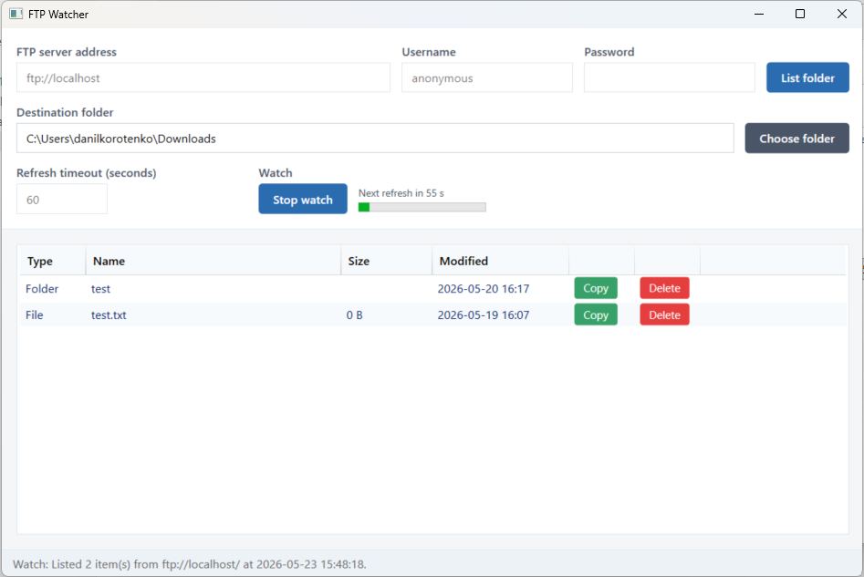

# FTP Watcher

A Windows desktop app for browsing an FTP server, copying files locally, deleting remote files, and monitoring a folder with automatic refresh.

Built with **.NET 9** and **WPF**.



## Features

### List FTP folder

Connect to an FTP or FTPS server and view the current directory in a table with type, name, size, and modified date.

1. Enter the **FTP server address** (for example `ftp://localhost` or `ftp://ftp.example.com/pub/`).
2. Set **Username** and **Password** if required (anonymous login is supported).
3. Click **List folder** or press Enter in the address field.

You can open subfolders from the list (double-click or right-click **Open**) and go up with the **..** entry.

### Copy files to a specified folder

Download files or entire folders from FTP to your PC.

1. Set the **Destination folder** manually or with **Choose folder**.
2. Click **Copy** on any file or folder row.

Files are saved under the destination path using the same name. Folders are copied recursively.

### Delete files from FTP

Remove files or folders directly on the server.

1. Click **Delete** on a row.
2. Confirm with **Yes** when asked *Are you sure?*

Folders are deleted recursively. This action cannot be undone.

### Watch FTP content

Periodically refresh the listing so you always see the latest remote files.

1. Set **Refresh timeout (seconds)** (default: 60).
2. Click **Start watch**.

While watching:

- The app lists the folder immediately, then again after each timeout.
- **Stop watch** ends automatic refresh.
- A countdown label (for example *Next refresh in 55 s*) and progress bar show time until the next refresh.
- The status bar reports each completed refresh with a timestamp.



## Settings

Connection details, destination folder, and refresh timeout are saved when the app closes and restored on the next launch. Settings are stored in:

`%AppData%\FtpWatcher\settings.json`

## Requirements

- Windows 10 or later
- [.NET 9 Desktop Runtime](https://dotnet.microsoft.com/download/dotnet/9.0) (for running from source)
- Network access to the target FTP server

## Run from source

```powershell
dotnet run --project FtpWatcher\FtpWatcher.csproj
```

Or open `FtpWatcher.sln` in Visual Studio and run the project.

## Build installer

From the repository root:

```bat
makeBuild.bat
```

This publishes the app and builds a per-user MSI installer (no administrator rights required). The installer is placed in the repository root as `ftp-watcher-<build>.msi`.

Install location: `%LOCALAPPDATA%\dkorotenko\FtpWatcher\`

## Project structure

| Path | Description |
|------|-------------|
| `FtpWatcher/` | WPF application source |
| `FtpWatcher/Installer/` | WiX installer definition |
| `screenshots/` | Application screenshots |
| `makeBuild.bat` | Publish and build MSI script |
